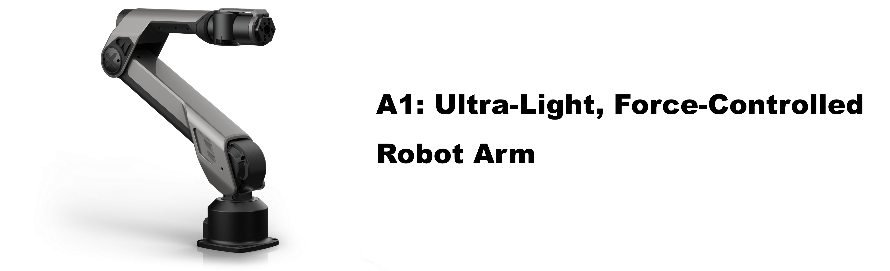
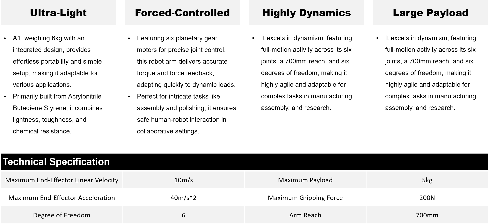

# Galaxea Robot

## Ultra-Light & Highly Dynamic
A1 is an Ultra-Light Force-Controlled robot arm known for its exceptional dynamism and significant high payload capacity. This cutting-edge technology makes it the optimal choice for sophisticated applications that demand nuanced interactions, owing to its outstanding electrical performance, robust handling capabilities, and versatile jointed structure.

It's superior high-speed operation, combined with precise force control, enables unparalleled performance across a variety of tasks, from delicate assembly operations to demanding research experiments. Its articulate design ensures adaptability across a broad range of motions, making it a versatile tool for industries seeking automation with finesse. 

## Key Hardware Features

## Enhance Your Robotics with Our Advanced Accessories
Discover the superior performance and innovative features of our accessories designed to optimize your A1 robot arm's capabilities.

### Accessory 1: Gripper One
Our high-precision gripper is designed for robust and versatile gripping solutions, making it ideal for various industrial applications. With its advanced mechanics and reliable performance, this gripper ensures secure handling and adaptability in diverse environments.

### Accessory 2: Gripper One Generation II
The Gripper One Generation II (G2) builds upon the foundation of the G1, offering an extended gripping range and increased gripping force. This upgraded version enhances performance and versatility, providing even greater precision and strength for demanding applications.

### Accessory 3: Dexterous Hand
The dexterous hand offers exceptional manipulation abilities with significant gripping strength and moderate speed, perfect for intricate tasks in robotics or prosthetics. Click to learn more about its features and capabilities.

## Ready for AI
Use case

## Discover More
If you wish to learn more about the hardware and software specifics of A1 robotic arm, please refer to the [Galaxea  A1 Guide](../../Guide/A1/Getting_Started.md) for detailed information.

The manual will provide you with comprehensive insights into the technical specifications, operational guidelines, and system requirements that will help you understand and utilize A1 to its fullest potential.
